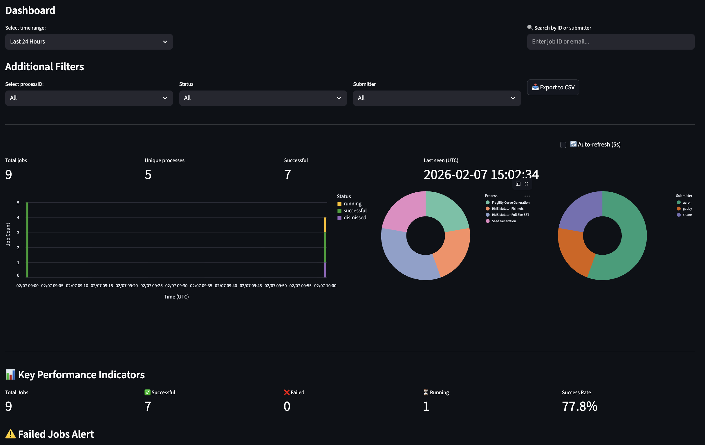
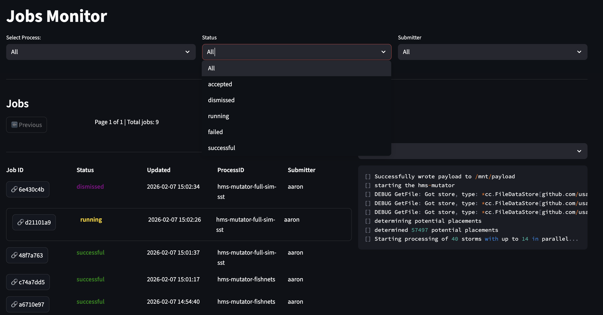
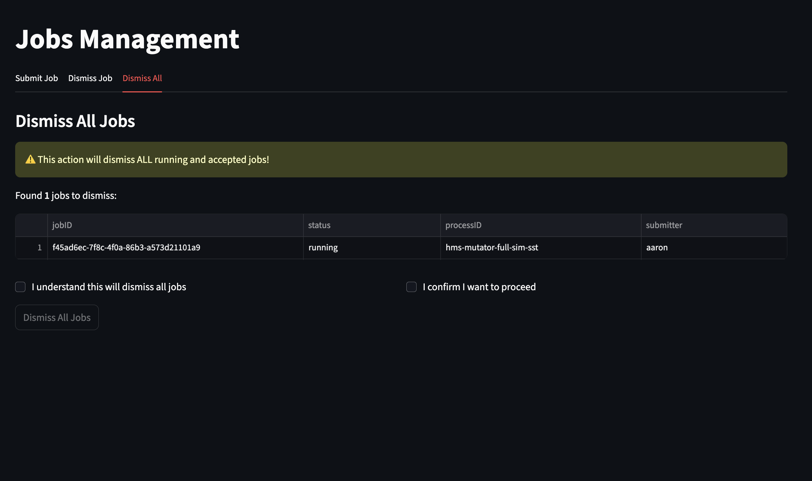

# sepex-viewer

Prototype Dashboard for [sepex](https://github.com/Dewberry/sepex)

**Home**: Real-time job monitoring dashboard with 24-hour bar chart, status filtering, search, and KPI metrics

**Monitor**:  Browse job information table for results, metadata, and logging

**Manage**: Job management table with submit/dismiss controls 

